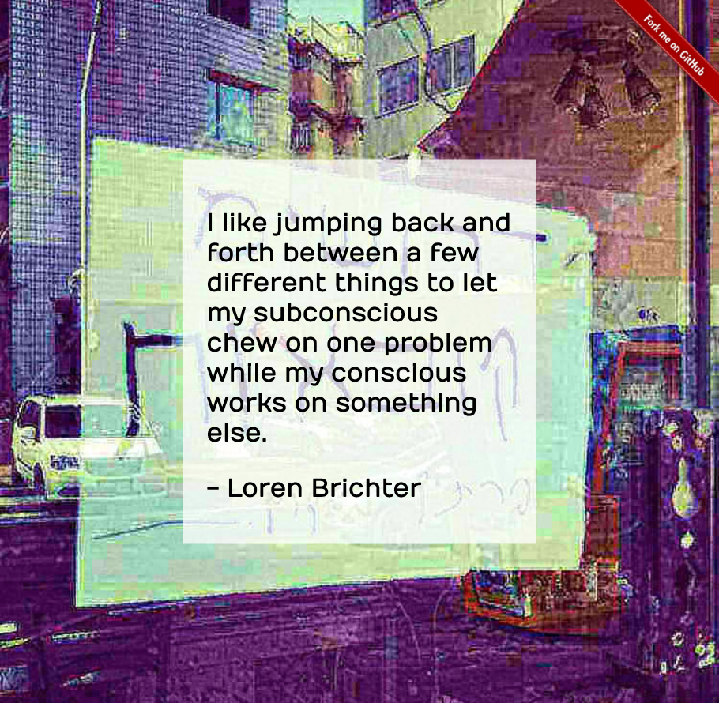
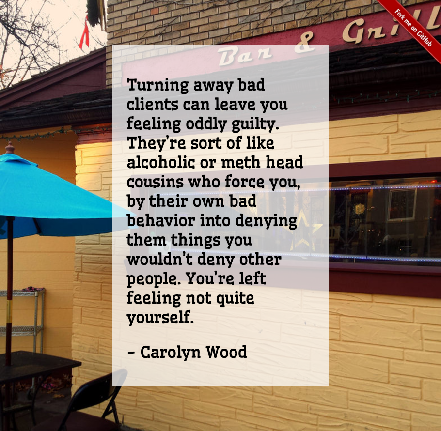
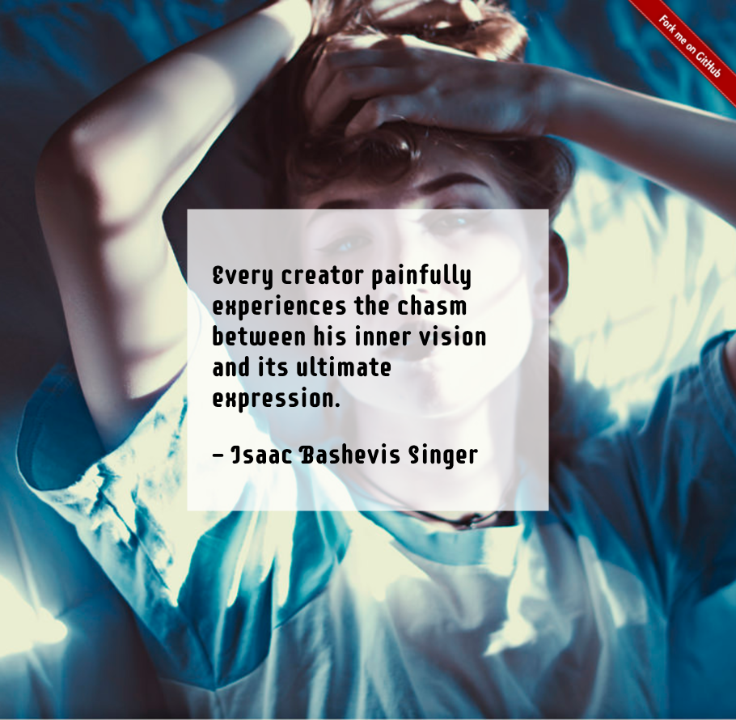
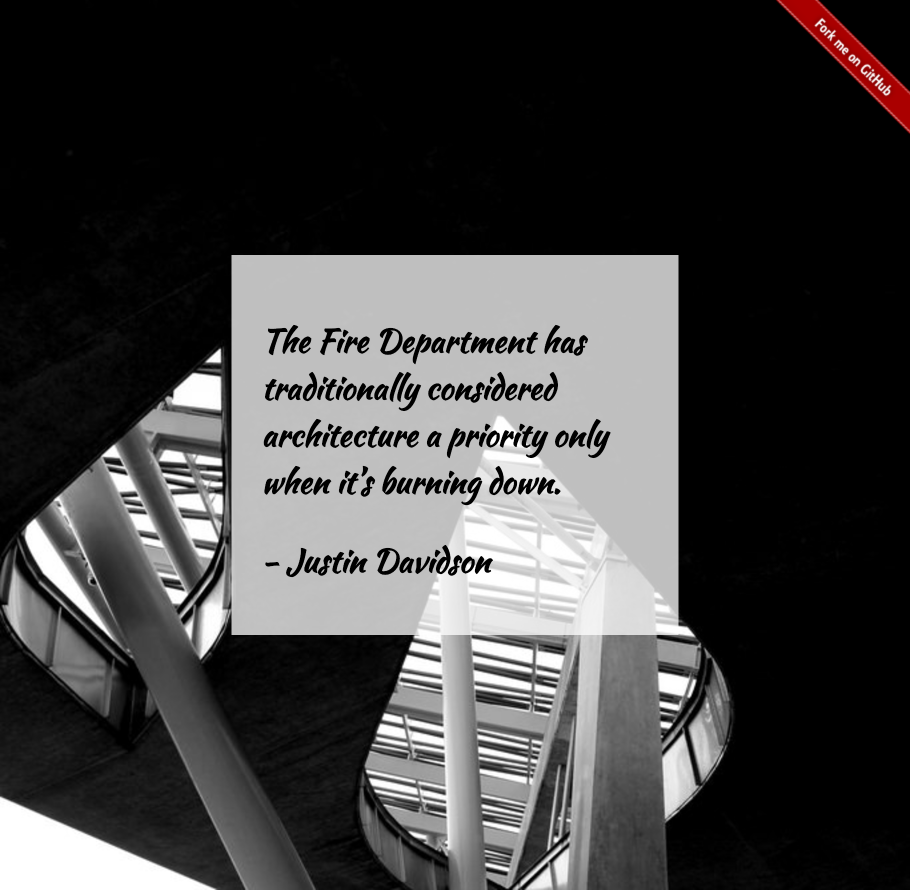

# Picture Quote Generator

A random picture quote every time you visit!

**[Try it out online ☞ Mondrian Generator](http://jefworks.github.io/picture-quote-generator/)**

Random quote using the [Quotes on Design API](https://quotesondesign.com/api-v4-0/). Words from quote are then used as keywords to get a random image using the [Flickr API](https://www.flickr.com/services/api/). Random font is also chosen from [Google Fonts](https://fonts.google.com/). 

Sample random picture quotes generated:

## Contributing
I welcome any bug reports, enhancement requests, and other contributions. To submit a bug report or enhancement request, please use the GitHub issues tracker. For more substantial contributions, please fork this repo, push your changes to your fork, and submit a pull request with a good commit message. 
